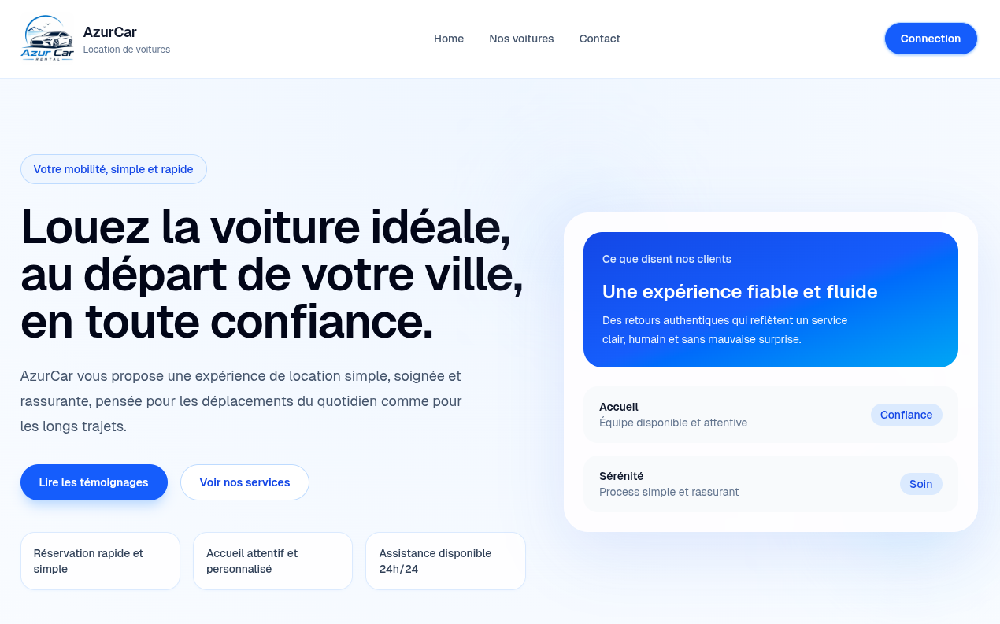
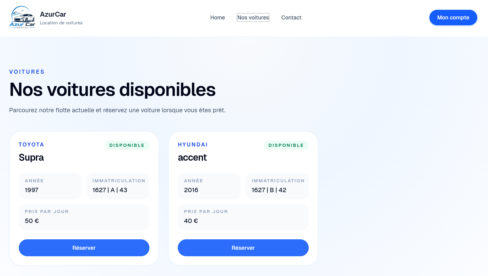
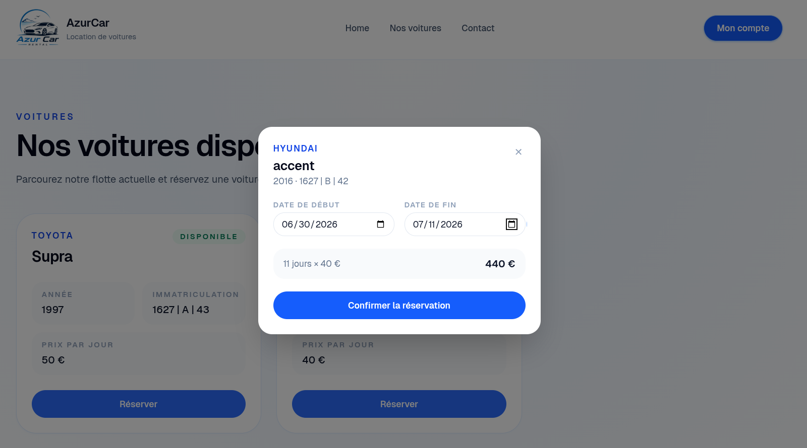
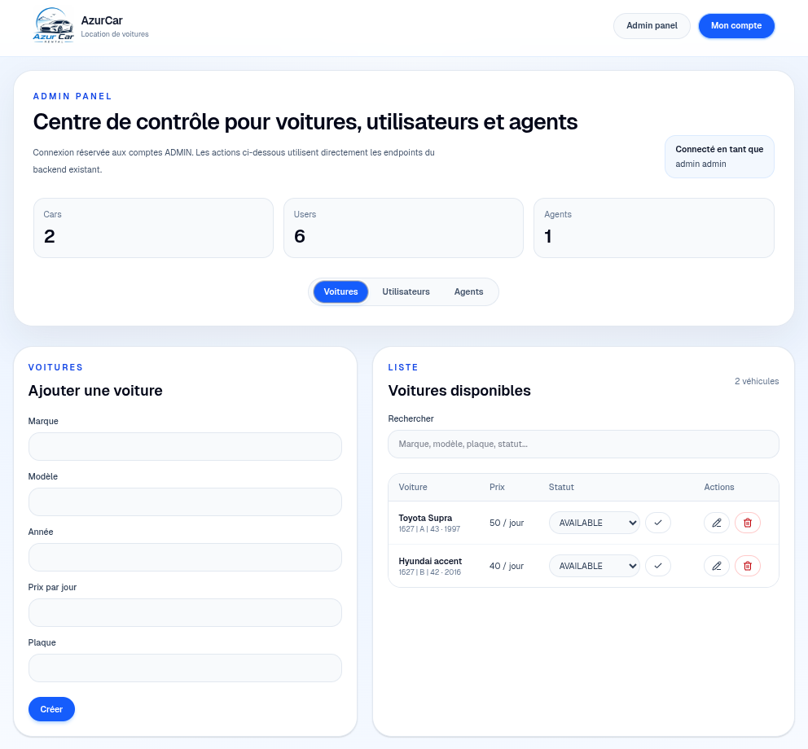

<div align="center">

# 🚗 Car Rental Management System

### Bachelor Final Studies Project (PFE)

**A full-stack platform for digitalizing car rental agency operations**

</div>

---

## 📖 Project Overview

This repository serves as the **main entry point** for the Car Rental Management System, a full-stack web application developed as part of a Bachelor Final Studies Project (PFE). The system was designed to **digitalize and streamline the management of a car rental agency**, replacing manual processes with a secure, centralized digital platform.

It provides:
- Secure authentication and role-based access
- Vehicle fleet management
- Reservation handling
- Customer management
- Administrative tools for oversight and control

---

## ✨ Features

- 🔐 **JWT Authentication & Authorization**
- 🚙 **Vehicle Management**
- 📅 **Reservation Management**
- 👤 **Customer Management**
- 🧑‍💼 **Agent Management**
- 🛠️ **Administrator Dashboard**
- 💻 **Responsive Web Interface**
- 🐳 **Dockerized Deployment**

---

## 📂 Repository Structure
backend/         Spring Boot REST API
frontend/        Next.js Web Application
deployment/      Docker Compose Deployment
report/          Bachelor Final Studies Project Report
presentation/    PowerPoint & PDF Presentation
demo/            Demonstration Video
screenshots/     UI Screenshots

---

## 🛠️ Technologies

| Category       | Technologies                              |
|-----------------|--------------------------------------------|
| **Backend**     | Java, Spring Boot, Spring Security, JWT, Hibernate / JPA |
| **Frontend**    | Next.js, React, Tailwind CSS               |
| **Database**    | MariaDB                                    |
| **Deployment**  | Docker, Docker Compose                     |

---

## 🚀 Getting Started

The easiest way to run the entire project is through the **deployment repository**, which orchestrates all services using Docker Compose.

### Prerequisites
- [Docker](https://www.docker.com/)
- [Docker Compose](https://docs.docker.com/compose/)

### Steps

1. Clone the deployment repository:
```bash
   git clone <deployment-repo-url>
```

2. Navigate into it:
```bash
   cd deployment
```

3. Create a `.env` file from the provided template:
```bash
   cp .env.template .env
```

4. Configure the environment variables in `.env` as needed.

5. Start the application:
```bash
   docker compose up -d
```

The application will be up and running with all services (backend, frontend, and database) orchestrated automatically.

---

## 📸 Screenshots

<div align="center">



<br/><br/>



<br/><br/>



<br/><br/>



</div>

---

## 🎥 Demo

A full demonstration video showcasing the application's features is available in the [`demo/`](./demo) directory.

---

## 👥 Authors

- **Yaaqoub Charkouk**
- **Abdellah Aghzal**

*Faculty of Sciences, Abdelmalek Essaâdi University*

---

<div align="center">

*Bachelor Final Studies Project — 2026*

</div>
